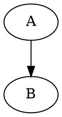
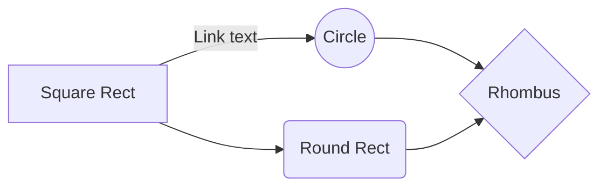
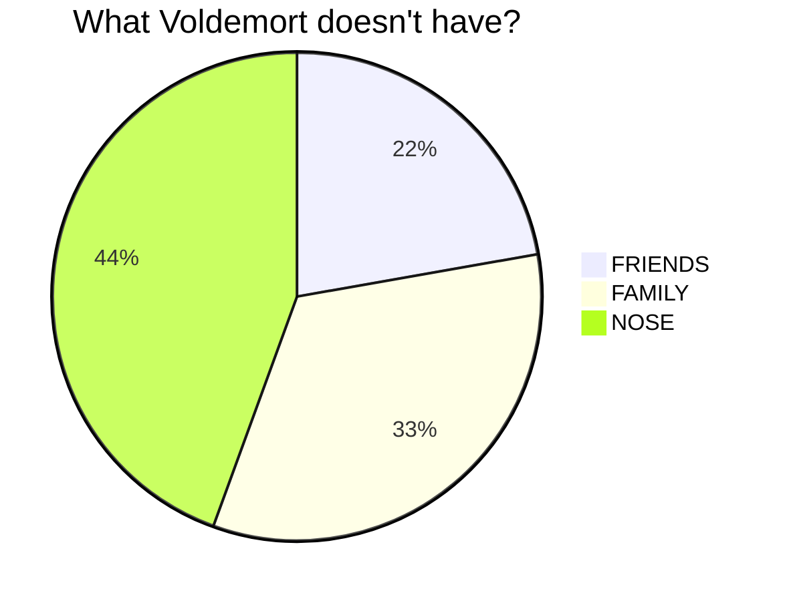

## Example title
Example text with list
- list item 1
- list item 2
- $x = \pi$


```graphviz
digraph {
    A -> B
}
```



```mermaid
graph LR
    A[Square Rect] -- Link text --> B((Circle))
    A --> C(Round Rect)
    B --> D{Rhombus}
    C --> D
```



```mermaid
pie title What Voldemort doesn't have?
"FRIENDS" : 2
"FAMILY" : 3
"NOSE" : 4
```


```python
print('Hello dude')
```


$$
x = \frac{-b \pm \sqrt{b^2-4ac}}{2a}
$$
